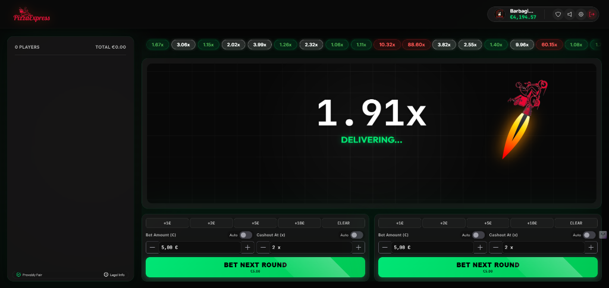

# Pizza Express Frontend 🍕🎨



> ⚙️ **Looking for the Backend?**
> This is the Angular Interface. To run the game engine, you need the Quarkus Backend:
> 👉 **[CLICCA QUI PER IL REPO DEL BACKEND](https://github.com/JFranciosi/pizza-express-backend)**

Frontend for the **Pizza Express** Crash Game, built with **Angular 20**.
A premium, responsive, and real-time betting interface.

## 🌟 Features

- **Dynamic Betting UI**:
  - Single Button Experience: Switches between **BET** (Green), **CANCEL** (Red + Timer), and **CASHOUT** (Orange).
  - Optimistic locking to prevent double bets.
- **Real-Time Visualization**:
  - `GameCanvasComponent`: Renders the flying pizza multiplier curve using HTML5 Canvas.
  - `GameSocketService`: Manages WebSocket connection for live game updates.
- **Components**:
  - `CrashHistory`: Live pills and full history table with verification support.
  - `RoundDetailsModal`: Professional modal for verifying round integrity (Seeds, Hash, breakdown).
  - `PlayerBets`: Live feed of all players' bets and winnings.
  - `Chat`: Real-time chat for players.
- **Authentication**: JWT-based Login/Register pages with dark/glassmorphism design.

## 🛠️ Tech Stack

- **Angular 20+** (Standalone Components, Signals)
- **PrimeNG**: UI Component Library (Inputs, Buttons, Toast).
- **RxJS**: Reactive state management.
- **Socket.io / WebSocket**: Real-time communication.
- **CSS3**: Custom variables, glassmorphism, animations.

## 🚀 Getting Started

### Prerequisites

- Node.js 18+
- Angular CLI

### Running the Application

1. Install dependencies:
   ```bash
   npm install
   ```

2. Start the dev server:
   ```bash
   npm start
   ```

3. Open `http://localhost:4200`.
   
## ☁️ Deployment

### 1. Build for Production
```bash
npm run build --prod
```

### 2. Netlify (Frontend)
- Drag and drop the `dist/pizza-express-frontend` folder to Netlify.
- **Important**: Ensure your `CORS_ORIGINS` on the backend includes your Netlify domain.

### 3. Azure (Backend)
- This frontend is configured to talk to: `https://pizzaezpress-cfhubva9axd0dxeq.italynorth-01.azurewebsites.net`
- Ensure the backend on Azure has the environment variable `CORS_ORIGINS` set to this frontend's URL.

## 📂 Project Structure

- `src/app/components`: Reusable UI blocks (`bet-controls`, `game-canvas`, `top-bar`, etc.).
- `src/app/services`: Business logic and API communication (`auth`, `game-api`, `game-socket`).
- `src/app/pages`: Main views (`home`, `login`, `register`).

## 🧪 Testing

Run unit tests:

```bash
ng test
```

## 🎨 Design System

- **Colors**:
  - Pizza Red: `#ff4444`
  - Success Green: `#4caf50`
  - Cashout Orange: `#ff9800`
  - Dark Backgrounds: Linear gradients `#1a1a1a` -> `#2d2d2d`
- **Typography**: Inter / JetBrains Mono (for numbers).